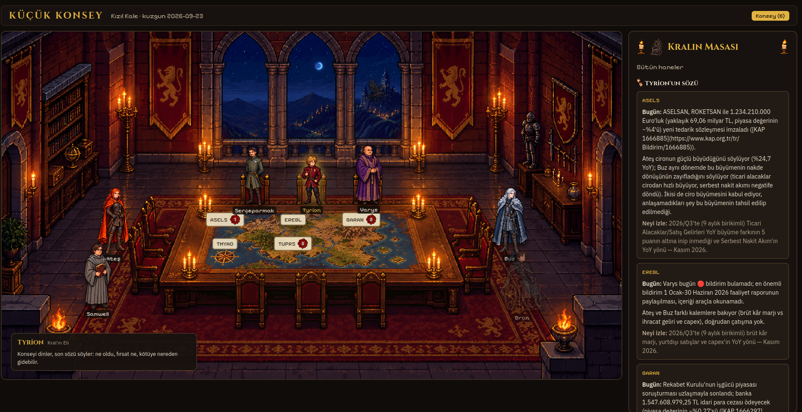

# Küçük Konsey

BIST şirketlerinin KAP bildirimlerini okuyan, tartışan ve günlük özet çıkaran bir ajan ekibi.
Her ajan bir Game of Thrones karakteri; kullanıcı tahtta, ajanlar Küçük Konsey'de.

**Fiyat tahmini yapmaz, al/sat demez.** Araştırma ve finans öğrenme aracı, yatırım tavsiyesi değil.



## Nasıl çalışıyor

```
KAP / borsa verisi
   ├─ kap MCP sunucusu (bu repo, Python)  → bildirim listesi + bildirim metni
   └─ borsa-mcp (dış kaynak)             → fiyat, bilanço, oranlar
   │
Claude Code subagent'ları
   Varys → Serçeparmak → Ateş / Buz (paralel) → Tyrion → Samwell
   │
Hafıza: markdown (hisar/ · kuzgunlar/)
   │
Westeros arayüzü (React + TypeScript)
```

| Ajan | Görev |
| --- | --- |
| Varys | KAP bildirimlerini ve günün haberlerini toplar, önem sınıfı verir |
| Serçeparmak | Bilanço rakamlarını kaynağıyla çıkarır |
| Ateş / Buz | Boğa ve ayı tezi |
| Tyrion | Konseyi dinler, günlük özeti (kuzgun) yazar |
| Samwell | Günün finans kavramını o günkü bildirimle örnekleyerek anlatır |

Tüm akış tek komutla çalışır: Claude Code içinde `/konsey`.

## Birkaç tasarım kararı

- **Kendi MCP sunucusu.** Hazır borsa MCP'sinin KAP araçları bozuktu, bu yüzden `kap/` altında küçük bir
  sunucu yazıldı. Bildirimler disk cache'inde tutulur (yayınlanan bildirim değişmez). Sayfa yapısı
  değişirse sessizce boş dönmek yerine hata verir.
- **Her sayı kaynaklı.** Özetteki her rakam KAP bildirim numarasına bağlanır; kaynağı olmayan sayı yazılmaz.
- **Geriye dönük test yok.** LLM geçmiş piyasayı ağırlıklarında bildiği için backtest yanıltıcı. Bunun yerine
  ajanların iddiaları tarihli olarak kaydedilir (`hisar/iddialar/`) ve sonradan gerçekleşenle karşılaştırılır.
- **KAP metni veridir, talimat değil.** Bildirim içindeki talimat benzeri cümleler uygulanmaz.

## Kurulum

Gerekenler: Python 3.12+, [uv](https://docs.astral.sh/uv/), Node.js, [Claude Code](https://claude.com/claude-code).

```sh
uv sync
uv run pytest          # internetsiz, kayıtlı KAP sayfalarıyla
```

Repo köküne `.mcp.json`:

```json
{
  "mcpServers": {
    "kap":   { "type": "stdio", "command": "uv", "args": ["run", "python", "-m", "kap.server"] },
    "borsa": { "type": "stdio", "command": "uvx",
               "args": ["--from", "git+https://github.com/saidsurucu/borsa-mcp@73a9df3e6e0e25a3e986514667301b110880dbc0", "borsa-mcp"] }
  }
}
```

Sonra `claude` ile oturumu aç ve `/konsey` çalıştır.

Arayüz:

```sh
npm --prefix web install
npm --prefix web run build
python3 scripts/web_server.py   # http://127.0.0.1:8765
```

## Durum

Çalışıyor: veri katmanı, 5 hisselik konsey turu, iddia defteri, arayüz.
Sırada: ajan trace görünümü, haftalık yansıtma (Bran) ve Varys'ın önem sınıflandırması için ölçüm seti.
Plan ve karar geçmişi: [`PLAN.md`](PLAN.md).
